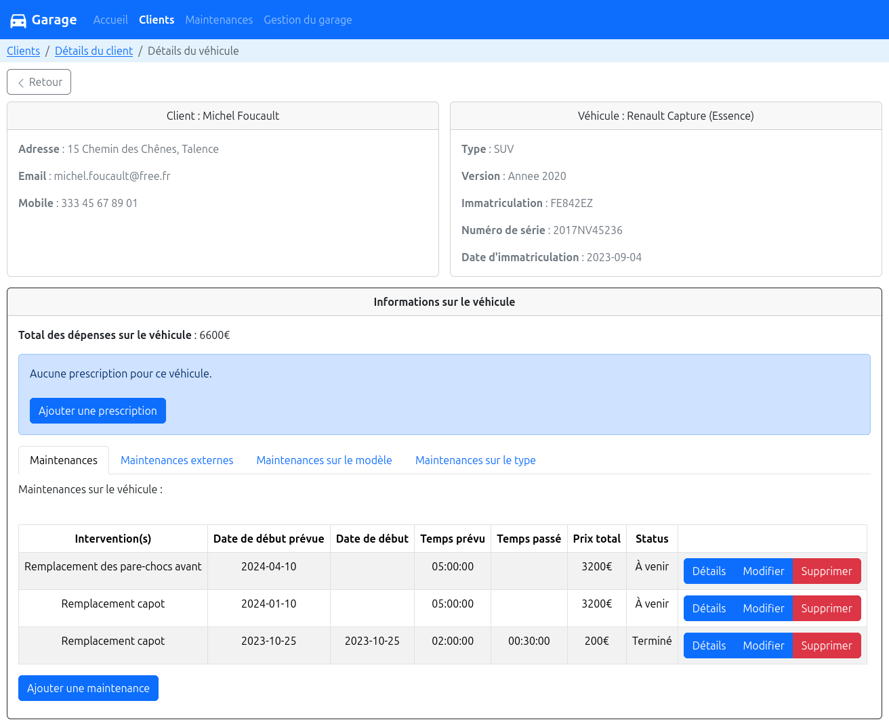
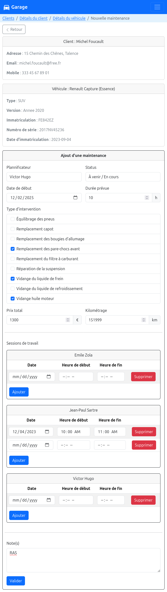

# Garage: Vehicle maintenances

This is a French website created using [Bootstrap](https://getbootstrap.com/), PHP, JS and PostgreSQL.

This project was carried out at Enseirb-Matmeca.

The aim was to create a website for garage employees to save data about their maintenances and their clients.
Give it a try by adding, modifying and removing some stuff :D

## Preview

Maintenances page for a specific client and a specific vehicle :



Add maintenance page :



### Required packages

Ubuntu :
```bash
sudo apt install apache2 php postgresql php-pgsql
```

### Install

Run script `run.sh` at the root of the repository :

```bash
sudo ./run.sh
```

Then, see `http://localhost/`.
